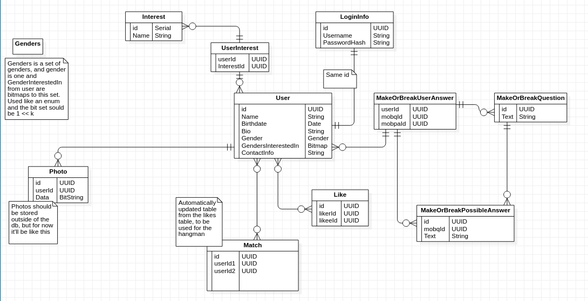

# Database schema

# Database configuration

Install postgresql and create a database named DatingHangman.
Run ./create_database.sql script on the database to create or reset the tables
schema

Run script ./user_choices.sql to populate Interest, MakeOrBreakQuestion, and
MakeOrBreakPossible answer tables.

To connect to the db change the connectionString with your credentials in
constants.js

Add secret.js with 

    export const jwtKey = "some-secret-key";

Change the jwtKey in secret.js so it's secure.

# API routes

## Login && create user

### Create a new login:

    POST /createLogin

body:

    {
        username: string,
        password: string
    }

returns:

    {
        id: UUID
    }

### Login:
    
    POST /login

body: 

    {
        username: string,
        password: string
    }

return:

    { accessToken : jwt token }

Use accessToken in the HTTP request as a header "Authorization: Bearer $accessToken"

## Queries that can be accessed by anybody(no login required)

### User profile by id:

    GET /profile/<username>

returns:

    {
        id: UUID,
        username: string,
        name: string,
        birthdate: date,
        bio: string,
        gender: Gender,
        gendersInterestedIn: integer, // bitmap, each bit represents a displaement by the id from the "Gender" table(ex. gender with id 1 is set means (gender & (1 << 1)) returns true(non zero)),
        interests: [ Interest, .. ],
        photos: [ Photo, .. ], // a maximum of 6
        questions_answers: { question_id: Question_Answer, .. }
    }

    where Gender is:

    id: integer // id of gender, get the gender from the "Gender" table

    where Interest is:

    {
        id: integer,
        name: string
    }

    where Photo is:

    {
        id: integer,
        data: base64 string
    }

    where Question_Answer is:

    {
        id: UUID, // id of question
        text: string,
        answers: [ Answer .. ]
    }

    where Answer is:
    
    {
        id: UUID, // make or break possible answer id
        text: string
    }

### Random user profile:

    GET /profile/random

### All make or break questions:

    GET /questions

returns:
    
    [ question .. ]

    where question is:

    {
        id: UUID,
        text: string
    }

### Make or break question possible answers:

    GET /questions/<question-id>/answers

returns:

    [ answer .. ]

    where answer is:

    {
        id: UUID,
        mobqid: UUID, // make or break question id
        text: string
    }

### All possible intersts/hobbies that someone can select:

    GET /interests

returns:
    
    [ interest .. ]

    where interest is:

    {
        id: integer,
        text: string
    }

### All possible genders that a user can choose:

    GET /genders

returns:

    [ gender .. ]

    where gender is:

    {
        id: integer, // to be used as an id when selecting a gender for a
        person, but as a binary left shift deviation for selecting multiple
        genders(genders interested in)
        text: string
    }

## Queries and updates on the user

### Update user data:
    
    PUT /user

body:

    {
        name: string,
        birthdate: date,
        bio: string,
        gender: integer, // GenderId
        gendersInterestedIn: integer // bitmap
        contactInfo: string
    }

returns: 
    
    STATUS 200

### Add user interests:

    PUT /user/interests

body:

    [ interestId: integer ]

### Remove user interests:

    DELETE /user/interests

body:

    [ interestId: integer ]

### Add make or break question / answer:

    PUT /user/answers

body:

    [ { mobqid: makeOrBreakQuestionId(UUID), mobpaid: makeOrBreakPossibleAnswerId(UUID) }, .. ]

returns:

    STATUS 200

### Remove make or break question / answer:

    DELETE /user/answers

body:

    [ { mobqid: makeOrBreakQuestionId(UUID), mobpaid: makeOrBreakPossibleAnswerId(UUID) }, .. ]

returns:

    STATUS 200

### Add user photos(user can have at most 6 photos):

    PUT /user/photos

body:

    [ Photo_file, .. ]

returns: 

    [ file_id1, file_id2, .. ]

### Remove user photos:

    DELETE /user/photos

body:

    [ id1, id2, .. ]

returns:

    STATUS 200

## Likes and matches

-------------------------------------------------------------------------------

### Get all users you have liked

    GET /likes

returns:

    [ { userid: UUID, username: string }, .. ]

### Like a user

    POST /likes

body:

    {
        userid: UUID
    }

returns:

    {
        status: "liked" | "matched",
        matchid: UUID // only if status is "matched"
    }

### Get all matches that you have

    GET /matches

returns:

    [ Match, .. ]

    where Match is:

    {
        id: UUID, // match id
        userid: UUID, // the id of the user you have matched
        username: string // username of the user you have matched
    }

### Get a match

    GET /matches/<match-id>

returns:

    Match

### Get contact info of a user

    GET /users/<user-id>/contact-info

returns:
    
    {
        contactInfo: string
    }

possible errors:

    "No successful match with the given user"
